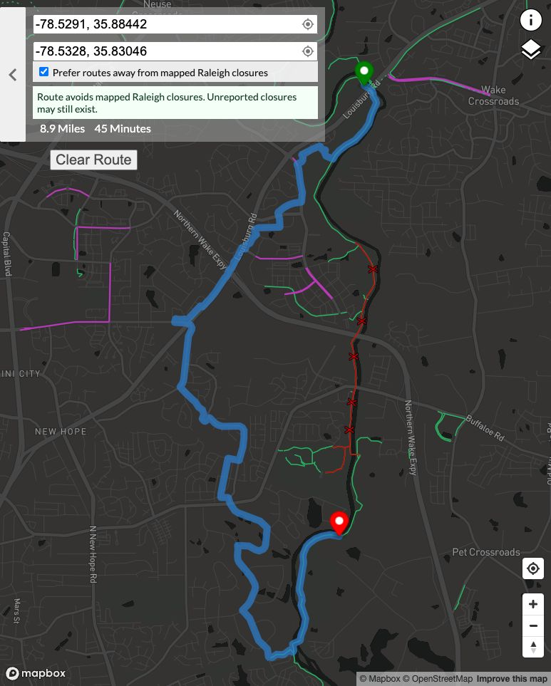

# Original PR screenshot regression

Recreated September 24, 2026 using the exact coordinates visible in
[the original PR screenshot](../../screenshots/closure-avoidance.png):

- Start: longitude **-78.5291**, latitude **35.88442**
- Destination: longitude **-78.5328**, latitude **35.83046**
- Profile: `brouter-profiles/standard.brf`
- Closure snapshot: [closures.geojson](../buffaloe-road/closures.geojson)

| Version | Route distance | Estimated time | Result |
| --- | ---: | ---: | --- |
| Original hard exclusions | 14,249 m | 2,697 s | Avoids closure areas |
| Weighted polygons alone | 7,135 m | 1,275 s | Follows about 3.2 km inside closures |
| Weighted polygons plus distance guard | 14,249 m | 2,697 s | Retries strictly and avoids closures |

The original screenshot displays **8.9 miles / 45 minutes**, matching the
strict detour reproduced here.

Increasing the polygon weight from 10 to 50 or 100 did not fix the shortcut.
BRouter's polygon intersection check only tests polygon boundaries before
applying the distance penalty; segments wholly inside an area can escape the
penalty. The app now measures inside distance independently and retries with
strict exclusions above 100 meters total. A strict result touching any closure
area is rejected.

`weighted-only.geojson` records the rejected shortcut, and `detour.geojson`
records the accepted strict route. Automated lifecycle tests use these recorded
responses and the closure snapshot to ensure only the detour is published.
The Buffaloe Road case is tested alongside this one and remains a short crossing.

To reproduce live, set the coordinates above with closure preference enabled
and use the current GIS feed. Expect a strict retry and the 8.9-mile detour,
subject to changes in GIS, OSM, or BRouter data.

